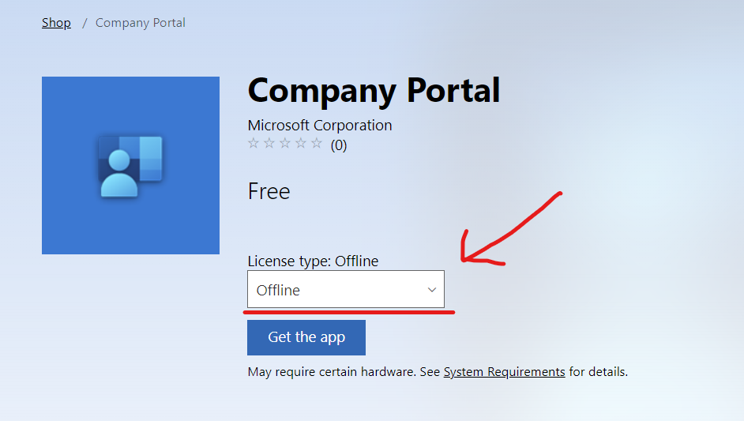

> **NOTE: The Microsoft Store for Business will be [retired in Q1 2023](https://techcommunity.microsoft.com/t5/windows-it-pro-blog/evolving-the-microsoft-store-for-business-and-education/ba-p/2569423)!**
> Functionality is to be replaced by the Windows Package Manager ([winget](https://github.com/microsoft/winget-cli)) and integration into Intune to enable easy deployment of both MS Store apps (such as the Company Portal), or Win32 Apps (such as Acrobat Reader, 7Zip and Google Chrome) from a validated [community repository](https://github.com/microsoft/winget-pkgs).
> This functionality is unlikely to be back-ported to ConfigMgr, so it is advised to begin preparing for this change by removing any reliance on the Store for Business where possible.
> Pages will be updated as soon as more information is available.
> Latest update (28/07/22): [Update to Endpoint Manager integration with the Microsoft Store on Windows](https://techcommunity.microsoft.com/t5/windows-it-pro-blog/update-to-endpoint-manager-integration-with-the-microsoft-store/ba-p/3585077)
> {.is-info}

When deploying a store app during the ESP stage of Autopilot, using the offline version of the app is preferred. This will install the app directly, and prevent the store from updating all of the provisioned apps, which can cause unpredictable delays during the ESP process.

We will use the Company Portal app as an example.

## Enable Offline Apps

In the Microsoft Store for Business

1. Click on Manage
2. Click on Settings
3. In the Shop tab, enable "Show offline apps"

## Adding the offline Company Portal app

1. Search the store for "Company Portal"
2. Set the license type to "Offline"
3. Click on "Get the app"

Once the app is synced to Intune, you can assign it to your Autopilot device groups.

https://docs.microsoft.com/microsoft-store/distribute-offline-apps#download-an-offline-licensed-app
