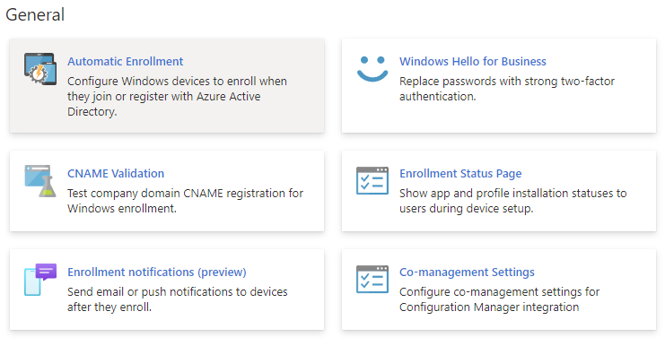

# Windows Enrollment

> MEM Portal Link:- [Enroll devices - Microsoft Endpoint Manager admin center](https://endpoint.microsoft.com/#view/Microsoft_Intune_DeviceSettings/DevicesEnrollmentMenu/~/windowsEnrollment)
> {.is-info}

## Best Practices

- [MDM User Scope set to `All`, MAM User Scope set to `None`](#automatic-enrollment)
- [Windows Hello for Business set to `Not Configured`](#windows-hello-for-business)
- [ESP configured to target an appropriate user group (E.g. All Autopilot Devices), leave Default ESP set to `No`](#enrollment-status-page)
  {.grid-list}

---

## General Configuration Options

## Options {.tabset}

### Automatic Enrollment

Automatic Enrollment is the same setting as going to the [`Mobility (MDM and MAM)`](https://portal.azure.com/#view/Microsoft_AAD_IAM/ActiveDirectoryMenuBlade/~/Mobility) page of Azure Active Directory, and contains two main options:

- **MDM User Scope**
  The MDM user scope is one of the key settings to allow users to be able to enroll devices into Intune, the other being an active Intune license. Under most cases, can safely be set to `All`

- **MAM User Scope**
  99.9% of the time should be set to `None`. Only used if

### Windows Hello for Business (WHfB)

This option allows you to set tenant-wide configuration for Windows Hello for Business for **All Users**
As the settings impact every user, it's recommended to instead configure a policy via [`Endpoint Security > Account Protection`](https://endpoint.microsoft.com/#view/Microsoft_Intune_Workflows/SecurityManagementMenu/~/accountprotection) as these can be more granularly targeted to user groups.

### CNAME Validation

The CNAME Validation option is purely a mini DNS checker that looks for the existence of CNAME records of `EnterprideEnrollment.companydomain.com` and `EnterpriseRegistration.companydomain.com` within DNS.

While most people configure this, it is optional not actually required under most circumstances, only being necessary where a tenant does not have AAD P1/P2, or you are getting users to register manually (not recommended). [More info.](https://learn.microsoft.com/en-us/mem/intune/enrollment/windows-enroll#simplify-windows-enrollment-without-azure-ad-premium)

### Enrollment Status Page

See [Enrollment Status Page](./enrollmentstatuspage.md)

### Enrollment Notifications (preview)

This new preview feature enables configuration of notifications to inform users that a device has been registered to them.
[Set up enrollment notifications in Intune - Microsoft Intune | Microsoft Learn](https://learn.microsoft.com/en-gb/mem/intune/enrollment/enrollment-notifications)

### Co-management Settings

If implementing Co-Management with ConfigMgr, these settings enable you to automatically deploy the ConfigMgr agent during Autopilot.
Requires the configuration of tenant attach and deployment of a Cloud Management Gateway (CMG).
[Cloud connecting with co-management - Configuration Manager | Microsoft Learn](https://learn.microsoft.com/en-gb/mem/configmgr/comanage/quickstarts)

---

## References & Links

> - [Set up enrollment for Windows devices by using Microsoft Intune | Microsoft Learn](https://learn.microsoft.com/en-us/mem/intune/enrollment/windows-enroll)
>   {.is-info}
